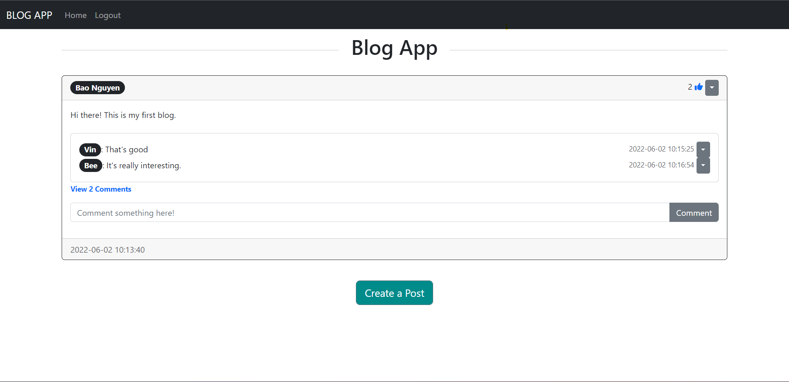

# Blog-App

### A Blog Application using Flask, Bootstrap, and SQLAlchemy


## Description
Building blog application with many features:
```bash
• User authorization and authentication
• Display posts of users
• Create and delete a post
• Like and comment a post
```

## Setup
Ensure you have python 3.6+ installed.
```bash
pip install -r requirements.txt
```

## Running the App
```bash
python app.py
```

## Clearing Database
```bash
To clear the database simply delete the 'database.db' file.
```
